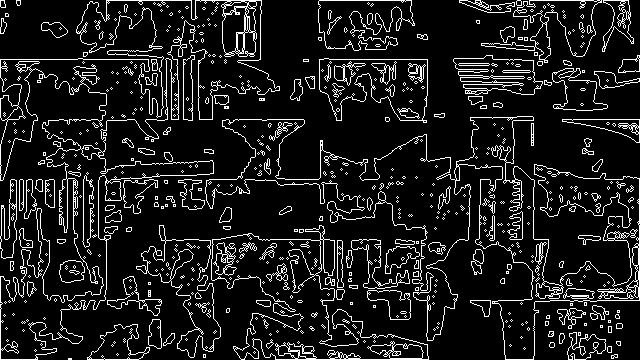

# video-detect
#### A C++ program analyzing video frames
[](https://github.com/cppengineer/video-detect/actions/workflows/docker-image.yml)

This program uses image detection to identify the frame sizes in a video grid such as in a video call. See the [example](#example) output at the bottom of this readme file.

## Quick Start
The quickest way to get started is to use the readily available docker image on docker hub as follows:
```sh
#
# video-detect quick start with docker
#
docker run \   # Initiate the docker container run command
       --rm \  # Cleanup the container afterwards
       -it \   # Run docker interactively in your CLI
       -v c:\share:/share \ # Create a volume to 
                            # share the specified folder (c:\share) with the
                            # target one (/share) in the container
       -t cppengineer/video-detect:latest \ # Docker will pull 
                                            # the latest image from docker hub
       --help # Add video-detect arguments here

# In full it looks like this for analyzing the a sample video in the c:\share folder
docker run --rm -it -v c:\share:/share -t cppengineer/video-detect:latest --infile /share/sample.mp4 
```

Use the `--help` argument to print out the available arguments and an **example** usage.

# System Requirements

## C++ Standard
The C++ standard used for this project is:
+ C++14

## Operating Systems
This project has been tested on the following operating system(s):
+ Linux (Ubuntu)

## Compilers
The compiler(s) supported and tested include:
+ GNU GCC 11.2.0

## Build System(s)
The following build system(s) is used:
+ CMake 3.18.4 & GNU Make 4.3

## Debugger
The following debugger was tested:
+ GNU GDB 10.1.90

## Unit Tests
The following test framework was used for the unit tests:
+ Google Test Framework release-1.10.0

# Build
A build from sources is done as follows:
```sh
# Clone the repository
https://github.com/cppengineer/video-detect.git

# Navigate into the source folder
cd video-detect

# Inside the source root directory
# Using the cmake build commands are required for getting
# the style checks root folder right

# Configure CMake (equivalent to 'cmake ..' from the build directory)
cmake -DBUILD_TESTING=ON -DCMAKE_BUILD_TYPE=Release -S . -B build
# Run the build (equivalent to 'make')
cmake --build build
# Run the unit tests (equivalent to 'make test')
cmake --build build -t test
# Install (equivalent to 'make install')
cmake --build build -t install
```
The available cmake **options** are:
+ Build unit tests: `BUILD_TESTING=[ON|OFF]`. Default is **OFF**
+ Check styles *(only if BUILD_TESTING=ON)*: `CHECK_STYLES=[ON|OFF]`. Default is **ON**
+ Build type: `CMAKE_BUILD_TYPE=[Release|Debug]`. Default is **Debug**

# Build Pipeline
This project uses a github workflow for building and deploying the docker image to docker hub. The latest build status is shown in the tag above.

# Example

**Original**
 
**Grayscale**

**Gaussian filter applied to smooth frames**

**Threshold filter to remove noise**

**Sobel Edge detection used to identify edges**

**Search for contours**

**Identify linear features**

**Find corners**


**Print the best estimate frame size**
*Example Console Output*:
```
CppEngineer: Video Detect, v. 1
[...]
video_file: /share/sample-6x6.mp4
size:   640x360
fps:    29.97 [fps]
length: 14.348 [sec]
[...]
Found individual frame size: 106, 60
```
Where **106x60** is **6x6** frames in **640x360**.


# Contact
For more information you can contact me through the contact page at [Cpp::Engineer](https://cppengineer.com)
